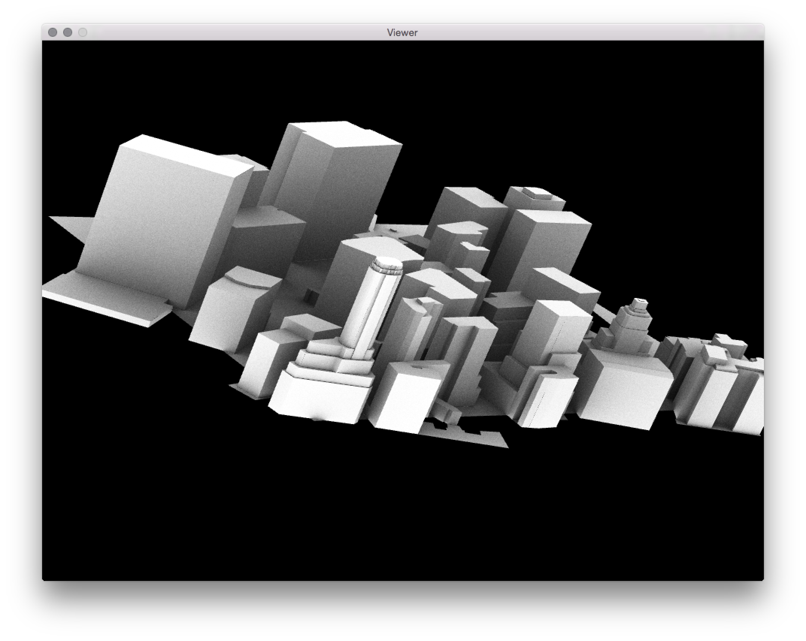
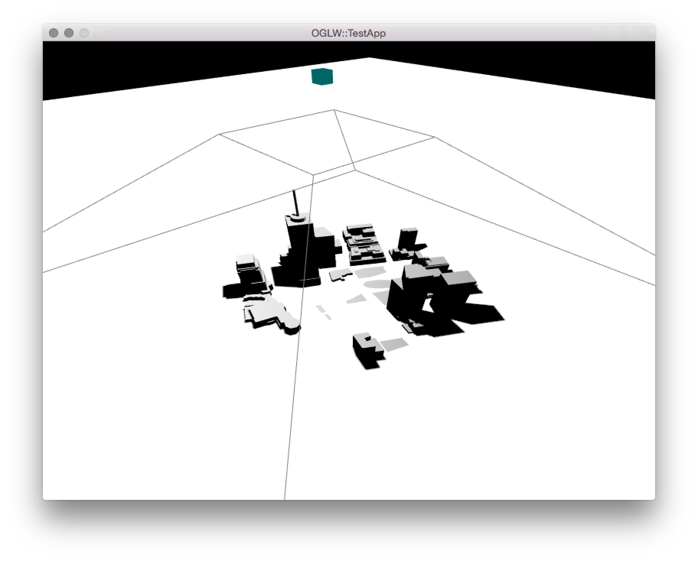
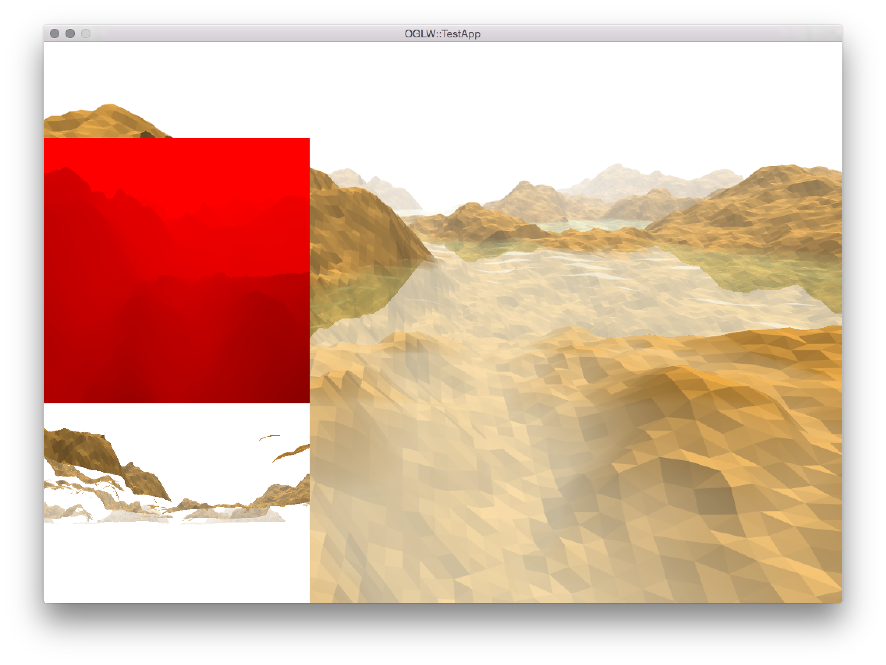
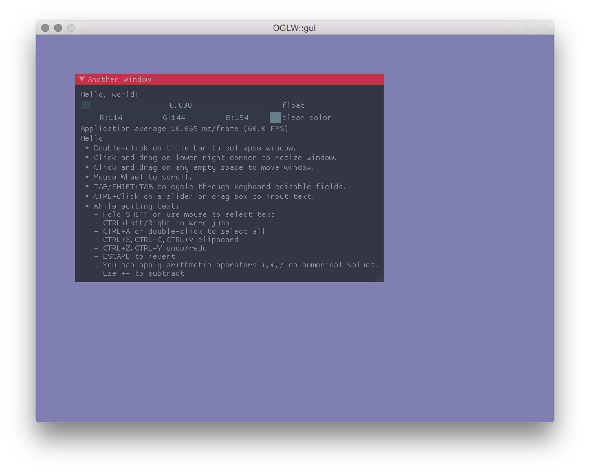
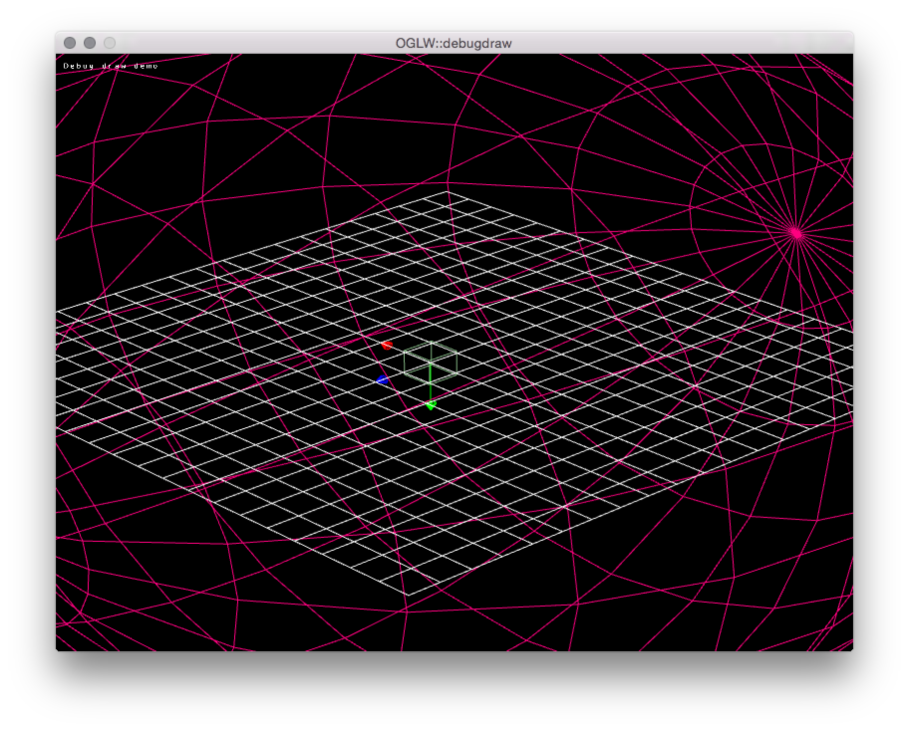
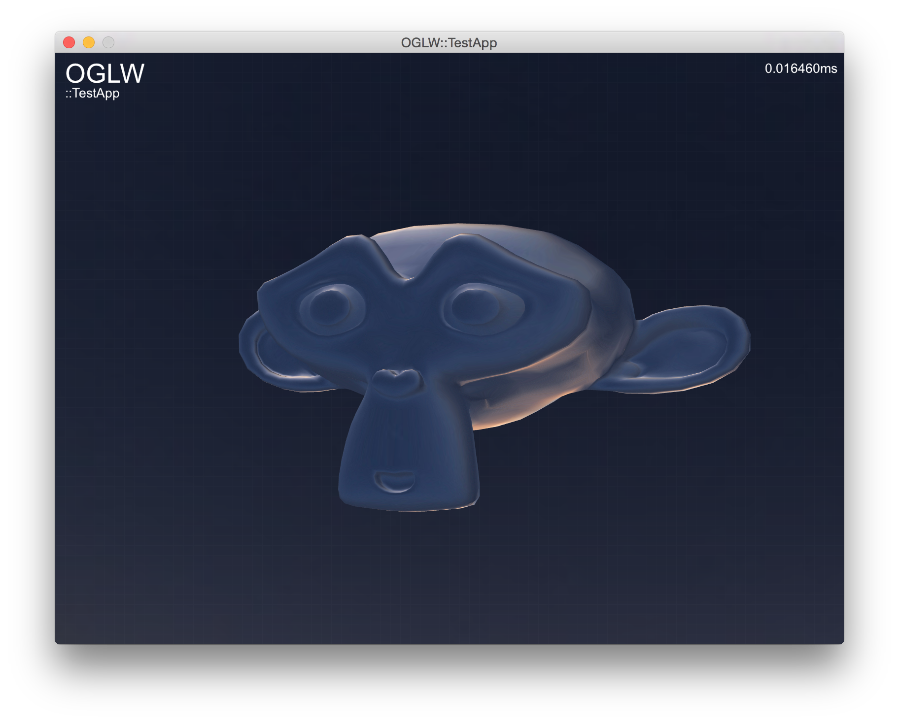
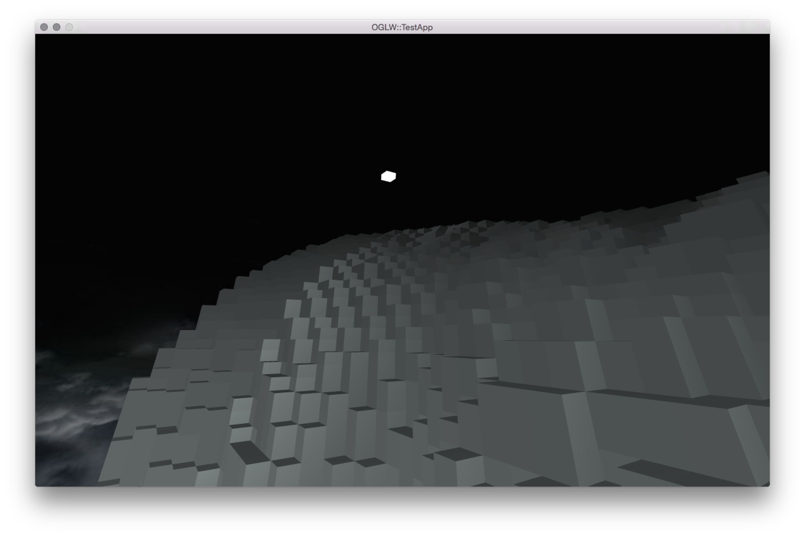

|Platform|Build Status|
|--------|------|
|OSX & Linux|[](https://travis-ci.org/karimnaaji/oglw)|


# OGLW
OGLW is a graphics library made on top of OpenGL 3.3; it has been built in a way that makes things _easy_ to set up and start a new project for rendering or graphics experimentation / creative coding.

The library has an internal system for OpenGL state tracking to reduce redundant state changes, and thus driver overhead (uniform, render states, texture/shader/uniform bindings, ...).

Setting up a new project
------------------------

OGLW uses _CMake_ (minimum version **3.0**), you can download it [here](http://www.cmake.org/download/) or use your favorite installation package tool like [homebrew](http://brew.sh/).


Building the samples on different platforms
-------------------------------------------
**Linux**

```
$ sudo apt-get install cmake portaudio19-dev libsndfile-dev
$ cmake . -Bbuild
$ cmake --build build
```
**OS X**

First install dependencies via homebrew:
```
$ brew install cmake portaudio libsndfile
```
Then run either this, to generate an XCode project:
```
$ cmake . -Bbuild -G Xcode
$ open build/OGLW.xcodeproj
```

Or if you don't want to use XCode:
```
$ cmake . -Bbuild
$ cmake --build build
```

Creating a standalone app
------------------------

**CMake**

The minimal cmake configuration you need to make an application using OGLW is the following:

```cmake
cmake_minimum_required(VERSION 2.8)
project(OGLWApp)
set(EXECUTABLE_NAME OGLWApp)
set(CMAKE_CXX_FLAGS "${CMAKE_CXX_FLAGS} -Wall -std=c++1y") # c++14 flags
add_subdirectory(${PROJECT_SOURCE_DIR}/oglw/oglw) # add OGLW library
include_directories(${OGLW_INCLUDE_DIRS}) # include OGLW headers
# don't use sound processing library
set(OGLW_BUILD_WITH_GAMMA OFF CACHE BOOL "Build the OGLW with Gamma library") 
add_definitions(-DOGLW_DEBUG) # build for debug
file(GLOB_RECURSE RESOURCES ${PROJECT_SOURCE_DIR}/resources/*) # find resources
# create an executable bundled with resources (For OS X)
add_executable(${EXECUTABLE_NAME} MACOSX_BUNDLE main.cpp ${RESOURCES})
target_link_libraries(${EXECUTABLE_NAME} OGLW ${OGLW_LIBRARIES})
set_target_properties(${EXECUTABLE_NAME} PROPERTIES RESOURCE "${RESOURCES}")
````

This will build a `.app` for each of the samples and output them in the `build/bin` folder.

**Code**

Associated with a main.cpp that looks like this:

```c++
#include "oglw.h"

using namespace OGLW;
class OGLWApp : public App {
    public:
        OGLWApp() : App({"OGLWApp", 
            false /* fullscreen */, 
            false /* resizable */, 
            960 /* width */, 
            720 /* height */}) 
        {}
        void update(float _dt) override;
        void render(float _dt) override;
        void init() override;
};
OGLWMain(OGLWApp);

void OGLWApp::init() {
  /// Initialization code goes here
}

void OGLWApp::update(float _dt) {
  /// Update code goes here
}

void OGLWApp::render(float _dt) {
  /// Rendering code goes here
}
```

An example of application using OGLW as a submodule can be found [here](https://github.com/karimnaaji/vectiler/tree/master/renderer).

**Shaders**

Shader are _bundled_ into one single file like this:

```glsl
// Hello World GLSL
#pragma begin:vertex
#version 330
in vec3 position;
uniform mat4 mvp;
void main() {
    gl_Position = mvp * vec4(position, 1.0);
}
#pragma end:vertex
#pragma begin:fragment
#version 330
out vec4 outColour;
void main(void) {
    outColour = vec4(0.0, 1.0, 0.0, 1.0);
}
#pragma end:fragment
```
Where the `#pragma begin:` and `#pragma end:` can reference a _geometry_, _vertex_, or _fragment_ shader.

Samples
-------
Please see the samples for a more detailed usage.

| Screenshot  | Name |
| ------------- | ------------- |
| [](/blocks)| [code](https://github.com/karimnaaji/vectiler/tree/master/renderer) |
| [](/blocks)| [code](https://github.com/karimnaaji/oglw/tree/master/samples/tile) |
| [](/blocks)| [code](https://github.com/karimnaaji/oglw/tree/master/samples/terrain) |
| [](/blocks)| [code]() |
| [](/blocks)| [code](https://github.com/karimnaaji/oglw/tree/master/samples/debugdraw) |
| [](/blocks)| [code](https://github.com/karimnaaji/oglw/tree/master/samples/mesh-sem) |
| [](/blocks)| [code](https://github.com/karimnaaji/oglw/tree/master/samples/voxel) |
